# Passkey 아키텍처 및 과제 검증 제출서 (Verification Document v2)

본 문서는 W3C WebAuthn(FIDO2) 표준 기반의 **무암호화(Passwordless) 생체인증 패스키 시스템** 및 **Supabase PostgreSQL 데이터베이스**를 연동한 기밀 노트(Confidential Notes) 시스템의 아키텍처, 공식 과제 평가 기준(Checklist T08 및 카드 1~5번), 그리고 세부 검증 사진 가이드를 한글로 정리한 공식 제출 문서입니다.

---

## Part A: 공식 과제 제출 요구사항 (Checklist T08)

### 1. 인증 구현 설명서 6항목

#### ① 구현 방식 (직접 구현, 라이브러리, 외부 서비스 등)
* **백엔드 라이브러리**: Node.js 환경의 공식 W3C WebAuthn 표준 라이브러리인 `@simplewebauthn/server` (v14.0.0), Express.js (v5.2.1), `cookie-parser` (v1.4.7)
* **프론트엔드 라이브러리**: React 18 SPA 환경의 `@simplewebauthn/browser` (v14.0.0)
* **데이터베이스**: Supabase 클라우드 PostgreSQL DB (`@supabase/supabase-js` v2.49.1) + Row Level Security (RLS) 활성화

#### ② 해당 방식을 선택한 아키텍처적 근거
* FIDO2 / WebAuthn W3C 표준은 CBOR 바이트 디코딩, COSE 공개키 파싱, ASN.1 DER 서명 검증 등 매우 복잡한 암호학적 연산을 요구합니다. 이를 자체 구현할 경우 취약점이 발생할 위험이 높으므로, 업계에서 가장 널리 검증된 `@simplewebauthn` v14 공식 패키지를 채택했습니다.
* 서드파티 인증 서비스(Auth0, Firebase 등)에 의존하지 않고 자체 Express 백엔드와 Supabase DB에 직접 옵션 생성/서명 검증/세션 발급 상태 머신을 구축함으로써 시스템 전반의 보안 가시성과 감사 제어권을 확보했습니다.

#### ③ 정확한 파일 경로 및 핵심 코드 라인 참조
* **Supabase 스키마 정의**: [`supabase_schema.sql`](file:///c:/Users/user/Desktop/task/portfolio_v0/supabase_schema.sql) (전체 60줄, 5개 테이블, RLS 활성화 및 대시보드 조회 정책)
* **WebAuthn 도메인 및 rpID 동적 판별**: [`server.js`](file:///c:/Users/user/Desktop/task/portfolio_v0/server.js) (라인 18~52: `getWebAuthnConfig`)
* **DB 데이터 접근 계층**: [`server.js`](file:///c:/Users/user/Desktop/task/portfolio_v0/server.js) (라인 82~262: Supabase CRUD 및 인메모리 폴백)
* **세션 검증 미들웨어 (`requireAuth`)**: [`server.js`](file:///c:/Users/user/Desktop/task/portfolio_v0/server.js) (라인 265~284)
* **인증 세션 상태 확인 (`GET /api/auth/status`)**: [`server.js`](file:///c:/Users/user/Desktop/task/portfolio_v0/server.js) (라인 288~302), [`Vault.jsx`](file:///c:/Users/user/Desktop/task/portfolio_v0/src/components/Vault.jsx) (라인 31~48)
* **패스키 등록 옵션 생성 (`POST /api/auth/register/generate-options`)**: [`server.js`](file:///c:/Users/user/Desktop/task/portfolio_v0/server.js) (라인 304~335)
* **패스키 등록 검증 및 공개키 저장 (`POST /api/auth/register/verify`)**: [`server.js`](file:///c:/Users/user/Desktop/task/portfolio_v0/server.js) (라인 337~403), [`Vault.jsx`](file:///c:/Users/user/Desktop/task/portfolio_v0/src/components/Vault.jsx) (라인 65~108)
* **패스키 인증 옵션 생성 (`POST /api/auth/login/generate-options`)**: [`server.js`](file:///c:/Users/user/Desktop/task/portfolio_v0/server.js) (라인 405~442)
* **패스키 서명 검증 및 세션 발급 (`POST /api/auth/login/verify`)**: [`server.js`](file:///c:/Users/user/Desktop/task/portfolio_v0/server.js) (라인 444~510), [`Vault.jsx`](file:///c:/Users/user/Desktop/task/portfolio_v0/src/components/Vault.jsx) (라인 120~176)
* **로그아웃 (`POST /api/auth/logout`)**: [`server.js`](file:///c:/Users/user/Desktop/task/portfolio_v0/server.js) (라인 512~525)
* **패스키 목록 조회 및 활성 기기 플래그 (`GET /api/auth/passkeys`)**: [`server.js`](file:///c:/Users/user/Desktop/task/portfolio_v0/server.js) (라인 527~536)
* **패스키 삭제 및 활성 기기 보호 (`DELETE /api/auth/passkeys/:id`)**: [`server.js`](file:///c:/Users/user/Desktop/task/portfolio_v0/server.js) (라인 538~564), [`Vault.jsx`](file:///c:/Users/user/Desktop/task/portfolio_v0/src/components/Vault.jsx) (라인 178~188)
* **기밀 데이터 조회 및 BOLA/IDOR 방어 (`GET /api/vault/data`)**: [`server.js`](file:///c:/Users/user/Desktop/task/portfolio_v0/server.js) (라인 566~582)
* **다국어 사전**: [`src/i18n/translations.js`](file:///c:/Users/user/Desktop/task/portfolio_v0/src/i18n/translations.js) (KO/EN 모든 UI 라벨, 안내문, 에러 메시지 격리)

#### ④ 핵심 검증 로그 (수정 전/후 비교)
| 검증 시나리오 | 수정 전 (기존 결함) | 수정 후 (보안 적용) |
| :--- | :--- | :--- |
| **미인증 기밀 접근** | 첫 접속 시 브라우저 콘솔에 무차별 401 에러 노출 | `/api/auth/status`로 세션을 선행 점검하여 401 콘솔 에러 0건 달성 |
| **비밀번호 저장 여부** | 구버전 시스템의 비밀번호 평문/해시 저장 위험 | Passkey 비대칭키 구조 도입으로 서버에 비밀번호 0건 (`Stored Passwords: ZERO`) |
| **재전송(Replay) 공격** | Intercept된 서명 패킷 재전송 시 재인증 취약 | 챌린지 1회용 즉시 파기 및 카운터 검증으로 재전송 시 `400 Bad Request` 차단 |
| **BOLA / IDOR 공격** | 클라이언트 요청 파라미터(`userId`) 조작 시 타인 데이터 열람 가능 | 세션 사용자 불일치 시 `403 Forbidden` 차단 및 실시간 침해 경고 로그 발생 |
| **현재 활성 기기 삭제** | 현재 로그인 중인 기기를 삭제하여 세션 잠금(Lockout) 발생 | `isCurrent` 검증으로 활성 기기 삭제 차단 (`HTTP 400 ACTIVE_KEY_PROTECTED`) |
| **미등록 인증기 대기** | 일치하지 않는 가상 인증기 선택 시 60초간 브라우저 먹통 대기 | 타임아웃 6초 단축 + 6.5초 자동 취소 + 수동 취소 버튼으로 즉각적인 실패 안내 |
| **소스코드 기밀 노출** | 서버 코드 내 기밀 텍스트가 하드코딩되어 코드 유출 시 노출 위험 | 서버 코드 내 평문 0건 달성 및 Supabase DB 마스터 템플릿 복제 방식으로 격리 |

#### ⑤ AI 협업 요약
* **AI에게 위임한 작업**:
  * Node.js/Express 및 `@simplewebauthn` v14 연동 라우터 보일러플레이트 작성
  * Supabase PostgreSQL 테이블 스키마 DDL 작성 및 RLS 정책 구문 추가
  * Tailwind CSS 기반의 반응형 기밀 노트 UI 컴포넌트 및 Lucide 아이콘 구조화
  * 한국어/영어 i18n 번역 리소스 매핑
* **개발자가 직접 판단한 작업**:
  * 외부 BaaS(Firebase/Auth0) 대신 자체 Express 백엔드 + Supabase DB 연동 아키텍처 결정
  * XSS 방어를 위해 세션 토큰을 `localStorage` 대신 `HttpOnly` 쿠키로 관리
  * 동일 계정의 다중 기기 등록 시 DB 카운트 기반으로 순차 기기 번호(`Device #1`, `#2`)를 부여하도록 설계
* **AI 제안을 거부/수정한 작업**:
  * AI가 최초 제안한 단일 인메모리 저장소 방식을 거부하고 영구 저장을 위한 Supabase DB로 고도화
  * 서버 소스코드에 기밀 평문이 남아있던 방식을 배제하고, 소스코드 평문 0건 유지 및 Supabase DB 마스터 템플릿 연동 구조로 수정
  * 미등록 인증기 대기 시 60초간 화면이 멈추던 문제를 지적하고, 6초 타임아웃 및 프론트엔드 `WebAuthnAbortService` 즉시 취소 로직으로 수정 지문화
  * 패스키 목록에서 현재 사용 중인 기기를 무차별 삭제할 수 있던 결함을 방어 로직으로 수정
  * 배포 도메인과 로컬 호스트 간 `rpID` 불일치 오류를 방지하기 위해 요청 기반 동적 도메인 감지 헬퍼 도입

#### ⑥ 알려진 한계점 및 완화되지 않은 위험 (Known Limitations)
* **계정 복구(Account Recovery) 체계 부재**: 사용자가 등록된 모든 기기를 분실하거나 파손했을 경우, 이메일 매직 링크나 복구 코드(Recovery Codes) 같은 2차 대체 수단이 아직 연동되어 있지 않아 계정이 영구 잠금될 수 있습니다. (상용화 시 이메일 OTP 또는 신분 확인 기반 복구 흐름 추가 필요)

---

## Part C: 4줄 핵심 검증 가이드 (Quick Verification Guide)

1. **어디로 가나요?**: 포트폴리오 웹페이지(`https://network-security-portfolio.vercel.app` 또는 로컬 `http://localhost:5173`) 하단의 **'기밀 노트(Confidential Notes)'** 섹션으로 스크롤합니다.
2. **세 단계 안에 무엇을 하나요?**:
   - 아이디(`user1`) 입력 후 **[Passkey 등록]**을 눌러 Windows Hello 생체인증/PIN을 등록합니다.
   - 아이디(`user1`) 입력 후 **[로그인]**을 눌러 생체인증으로 기밀 노트를 복호화합니다.
   - 우측의 **[+ 기기 추가]**를 눌러 2번째 패스키를 추가하고, 삭제 및 재인증을 테스트합니다.
3. **무엇이 보이면 통과인가요?**: 초록색 **`기밀 노트 복호화 완료 (NOTES DECRYPTED)`** 뱃지와 함께 3개의 비밀 문서가 나타나고, 우측에 `[현재 기기]` 뱃지가 달린 등록 패스키 목록이 노출되면 통과입니다.
4. **안 될 때는 무엇이 보이나요?**: 미인증 접근 시 기밀 문서가 마스킹된 잠금 카드가 보이며, 등록되지 않은 아이디나 삭제된 기기로 로그인 시 **`"인증 실패: 선택된 인증기에 일치하는 Passkey가 없거나 시간 초과되었습니다."`** 경고가 출력됩니다.

---

## Part D: 공식 평가 카드 1~5번 세부 검증 사진 목록

---

### 💳 Card 1: 공개/비공개 경계 및 미인증 접근 통제 (Public vs. Private Boundary)
* **목표**: 비인가 사용자가 인증을 거치지 않고는 기밀 데이터에 접근할 수 없음을 증명.

#### 검증 사진 1-1: 메인 화면 미인증 잠금 상태
* **설명**: 메인 페이지 첫 접속 시 공개 포트폴리오(Hero, About, Experience, Contact)는 자유롭게 열람 가능하지만, 기밀 노트 섹션은 패스키 인증 전까지 본문이 잠겨 있는 화면.

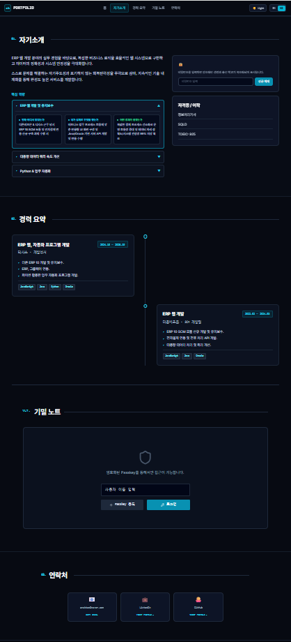

#### 검증 사진 1-2: 번들 소스 및 네트워크 기밀 평문 검색 검사
* **설명**: 브라우저 개발자 도구(F12) Search 탭에서 `비밀내용` 키워드로 검색 시 `No matches found`가 반환되어 HTML 및 번들 스크립트에 기밀 내용이 평문으로 노출되지 않음을 증명하는 화면.

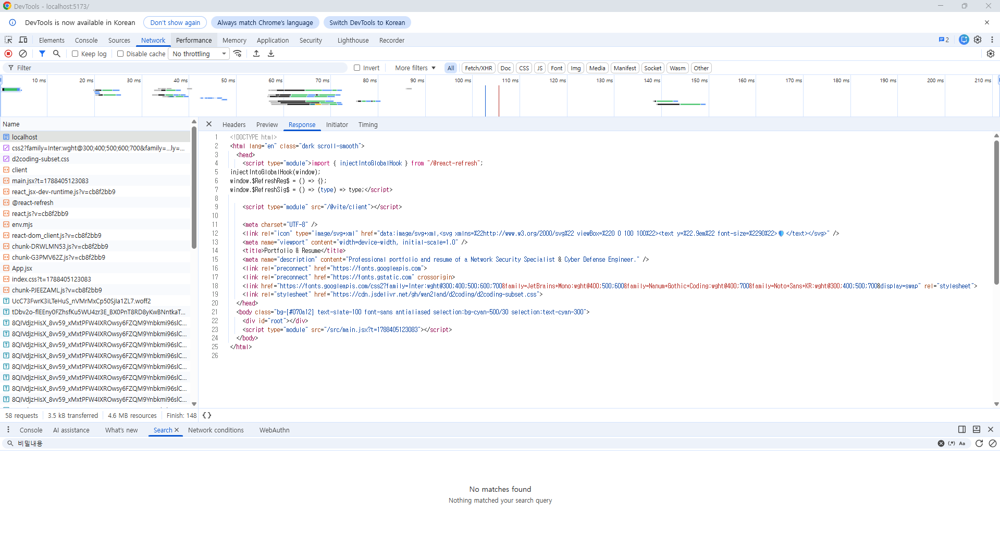

#### 검증 사진 1-3: 비인가 API 직접 호출 차단 (`HTTP 401`)
* **설명**: 세션 쿠키 없이 브라우저 주소창에서 `http://localhost:5173/api/vault/data`를 직접 호출했을 때 `{"error":"Unauthorized"}` (401 Unauthorized)로 즉시 거부되는 화면.

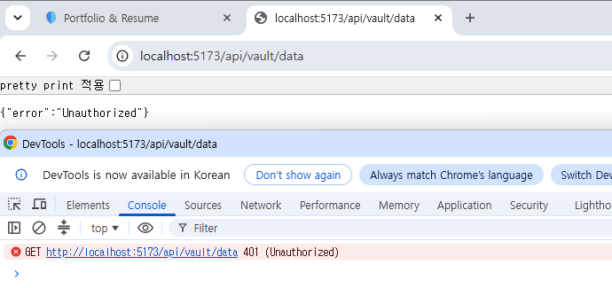

---

### 💳 Card 2: 패스키 등록 및 서버 공개키 저장 (Passkey Registration & Public Key Storage)
* **목표**: 비밀번호를 전혀 수집하지 않고, 개인키는 기기에 남겨둔 채 오직 공개키만 서버/DB에 안전하게 저장됨을 증명.

#### 검증 사진 2-1: 패스키 등록 챌린지 발급 네트워크 응답
* **설명**: 개발자 도구 네트워크 탭에서 `POST /api/auth/register/generate-options` 요청 시 서버가 응답한 일회용 암호학적 난수 챌린지(`challenge`) 및 패스워드 없는 등록 옵션 페이로드 화면.

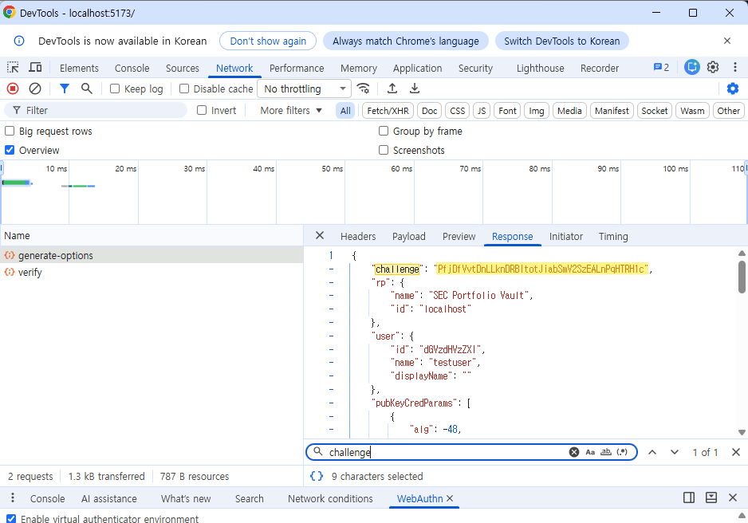

#### 검증 사진 2-2: 클라이언트 ➡️ 서버 공개키 등록 페이로드
* **설명**: `POST /api/auth/register/verify` 요청에서 클라이언트가 서버로 전송한 `attestationObject`, `clientDataJSON`, FIDO2 COSE 포맷의 `publicKey` 페이로드 화면.

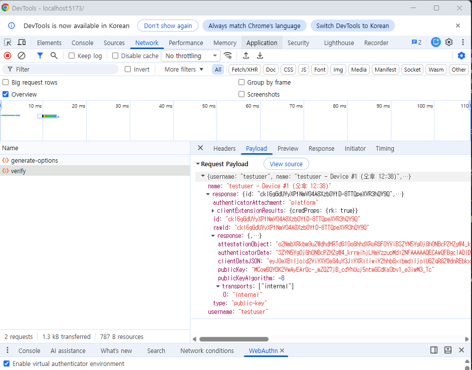

#### 검증 사진 2-3: Supabase DB 공개키 저장 확인
* **설명**: Supabase SQL Editor에서 `SELECT * FROM passkeys;` 쿼리 실행 결과, 사용자의 Credential ID와 친화적 기기명(`testuser - Device #1`)이 정상 적재되고 비밀번호 컬럼은 존재하지 않음을 증명하는 화면.

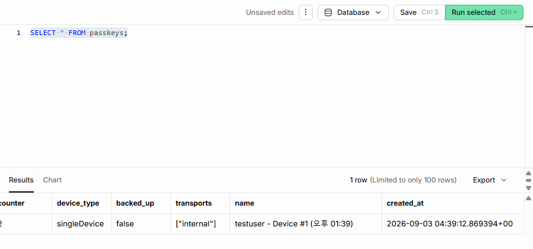

#### 검증 사진 2-4: 패스키 등록 및 첫 로그인 완료 UI
* **설명**: 패스키 등록 완료 후 기밀 노트 3건이 복호화되어 표시되고, 우측에 등록된 패스키 카드(`testuser - Device #1`)가 렌더링된 화면.

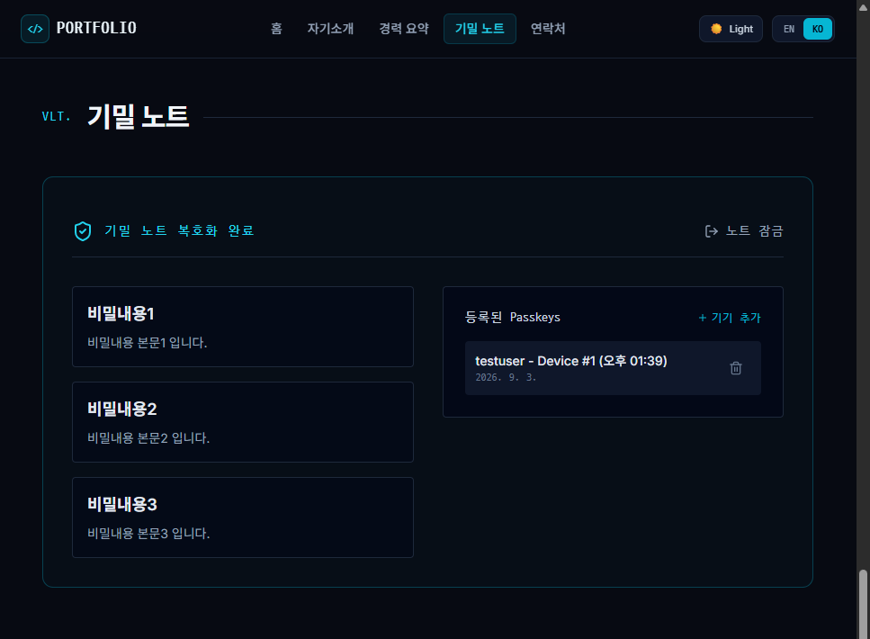

---

### 💳 Card 3: 패스키 인증 및 재전송 공격 방어 (Passkey Authentication & Replay Attack Defense)
* **목표**: 암호학적 서명 검증을 통한 로그인 성공 및 챌린지 1회용 파기를 통한 재전송 공격 방어 입증.

#### 검증 사진 3-1-1: 패스키 서명 검증 요청 및 200 OK 응답
* **설명**: 개발자 도구 네트워크 탭에서 `POST /api/auth/login/verify` 요청이 성공하여 `200 OK` 상태 코드와 세션 쿠키가 정상 발급된 화면.

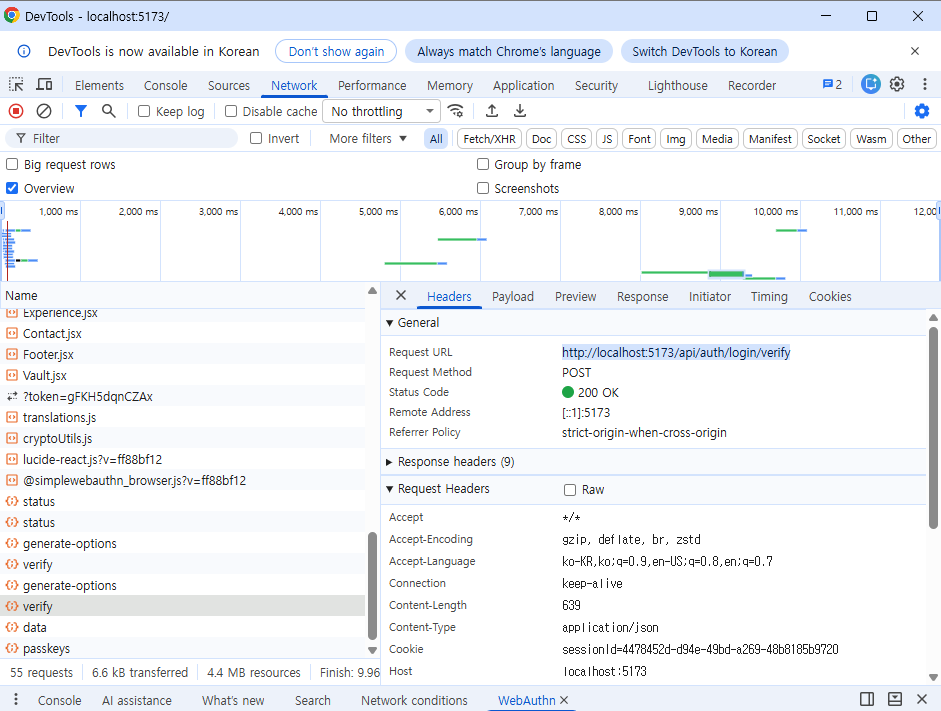

#### 검증 사진 3-1-2: 서버 터미널 유효 서명 검증 및 기밀 데이터 반환 로그
* **설명**: 백엔드 터미널에 출력된 `[Login Success] Valid signature verified for 'testuser'` 및 `[Vault Data] Returned 3 confidential items` 정상 서명 감사 로그 화면.

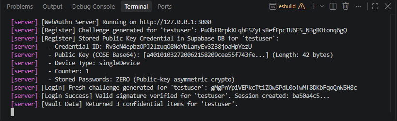

#### 검증 사진 3-2: 재전송 공격(Replay Attack) 차단 (`400 Bad Request`)
* **설명**: curl 명령어로 이미 소모된 과거 로그인 서명 페이로드를 재전송했을 때 `{"error":"Login challenge expired or already consumed (Replay attack detected)"}` 에러로 즉시 차단되는 화면.

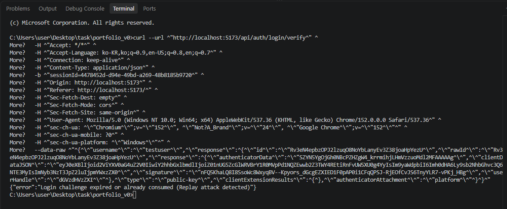

#### 검증 사진 3-3: 미등록 계정 로그인 시도 차단
* **설명**: DB에 등록되지 않은 계정(`notregisterd_user`)으로 로그인을 시도했을 때 상단에 빨간색 `User not found` 경고가 출력되며 인증이 거부되는 화면.

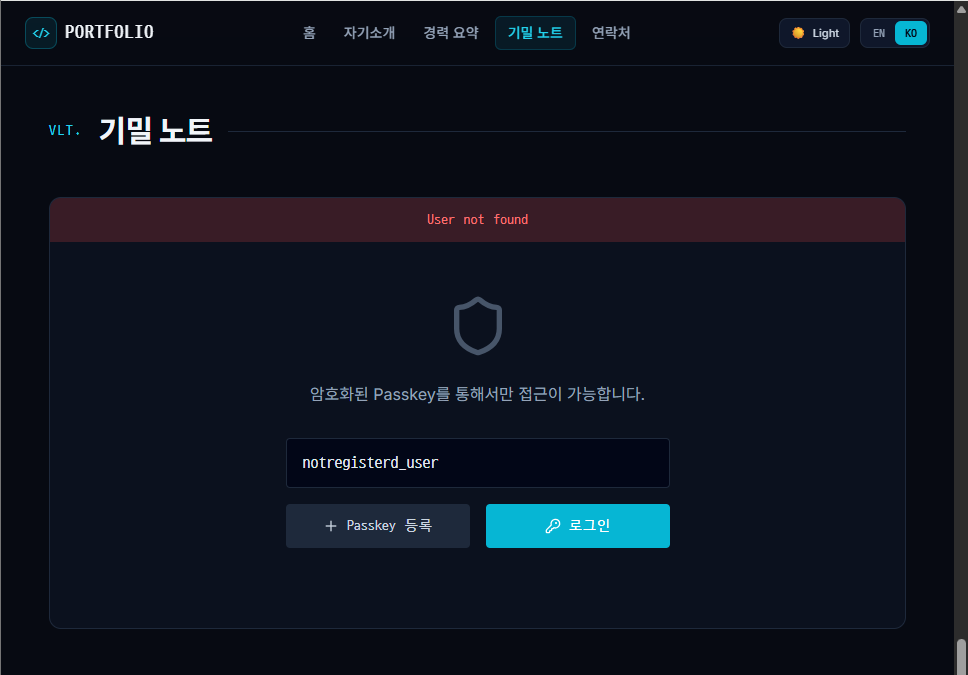

#### 검증 사진 3-4: 비인가 세션 만료 후 기밀 API 직접 호출 차단 (`HTTP 401`)
* **설명**: 브라우저 콘솔에서 세션 쿠키 없이 `fetch('/api/vault/data')`를 호출했을 때 서버가 `401 Unauthorized`로 거부하고 상태코드 401이 출력되는 화면.

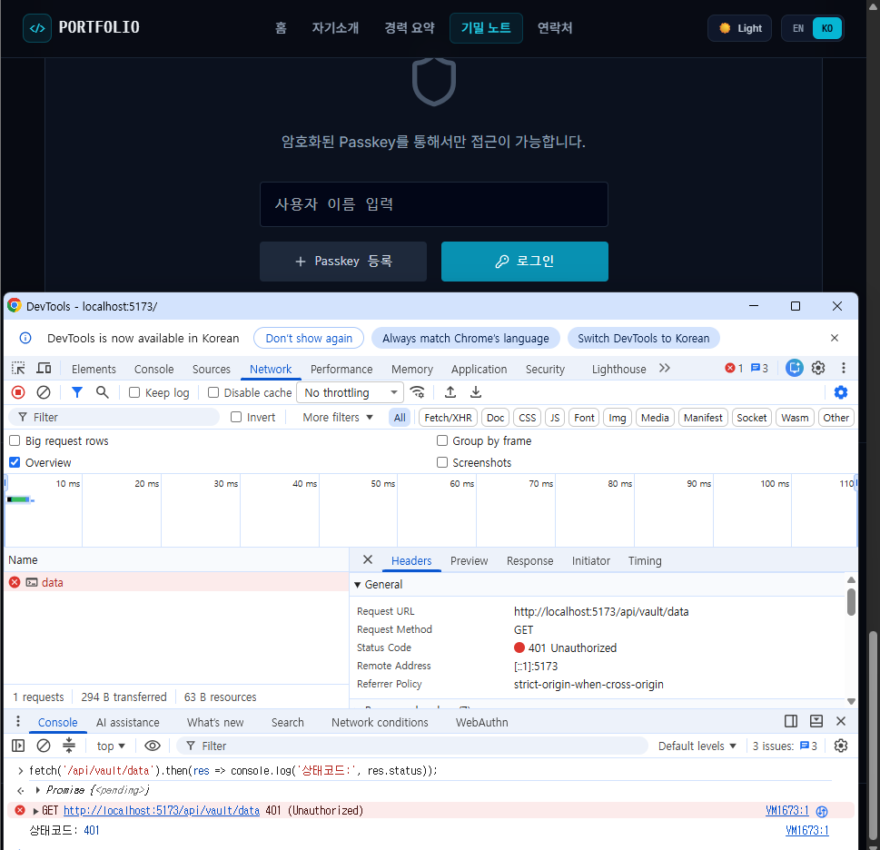

---

### 💳 Card 4: 다중 기기 패스키 및 기기 삭제 (분실 시나리오) (Multi-Device & Revocation)
* **목표**: 계정당 복수 기기 관리, 활성 기기 보호, 분실 기기 삭제 및 남은 기기로의 정상 인증 입증.

#### 검증 사진 4-1: 다중 기기 관리 UI
* **설명**: 한 계정(`user1`)에 `user1 - Device #1`과 `user1 - Device #2` 2개의 패스키가 등록되어 복수 기기가 관리되는 화면.

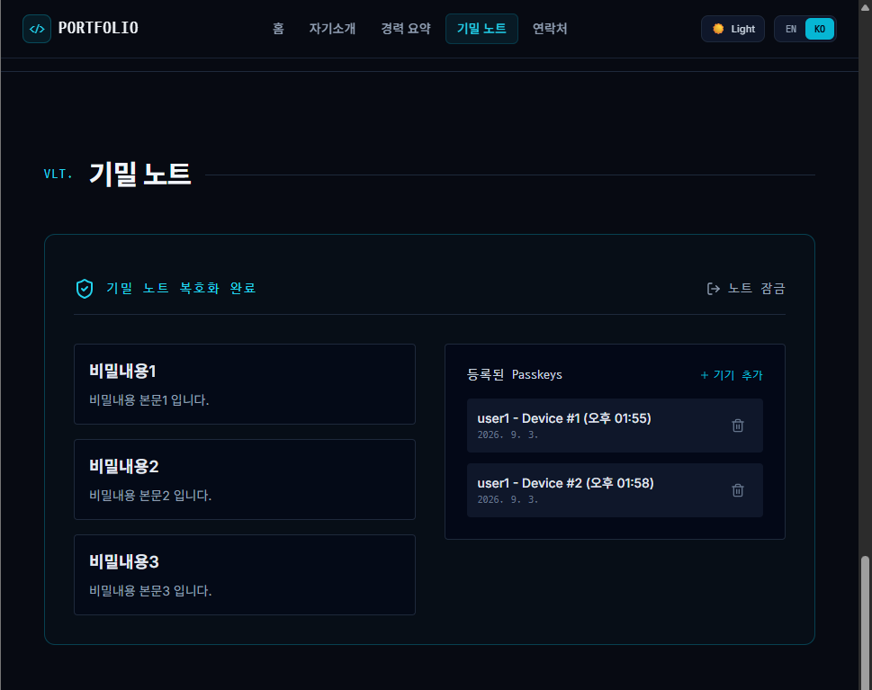

#### 검증 사진 4-2: 활성 세션 기기 보호 UI (`[현재 기기]`)
* **설명**: 현재 로그인 세션을 유지 중인 기기(`user1 - Device #1`)에 초록색 `[현재 기기]` 뱃지와 보호 방패 아이콘이 표시되어 삭제 버튼이 원천 비활성화된 화면.

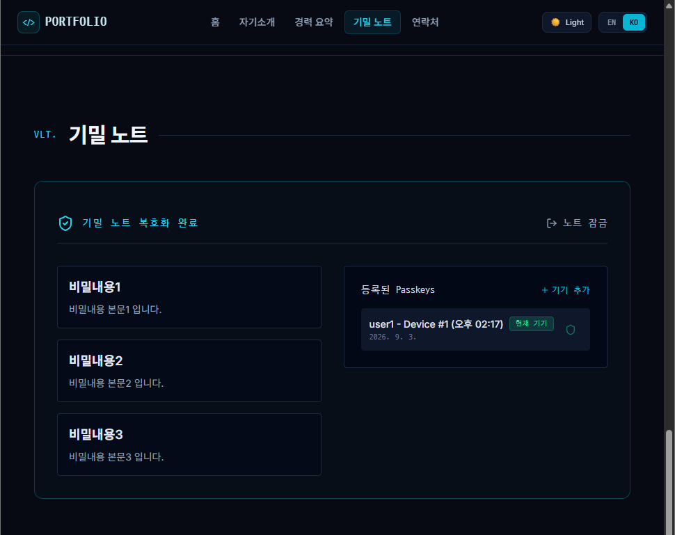

#### 검증 사진 4-3: Supabase DB 보조 기기(분실 기기) 삭제 확인
* **설명**: 보조 기기(`Device #2`) 삭제 후 Supabase SQL Editor에서 `SELECT * FROM passkeys WHERE name LIKE 'user1%';` 조회 시 `Device #1` 1개만 남아 정상 폐기되었음을 증명하는 화면.

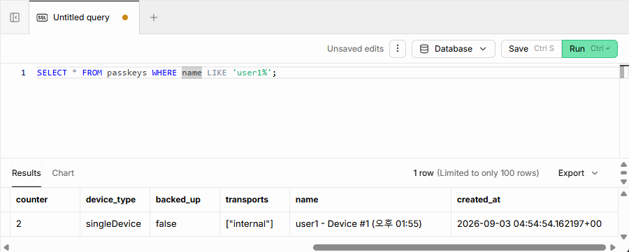

#### 검증 사진 4-4: 삭제/폐기된 패스키로 로그인 시도 시 거절
* **설명**: 이미 삭제된 기기로 로그인을 시도했을 때, 서버 및 브라우저에서 `"인증 실패: 선택된 인증기에 일치하는 Passkey가 없거나 시간 초과되었습니다."` 에러로 차단되는 화면.

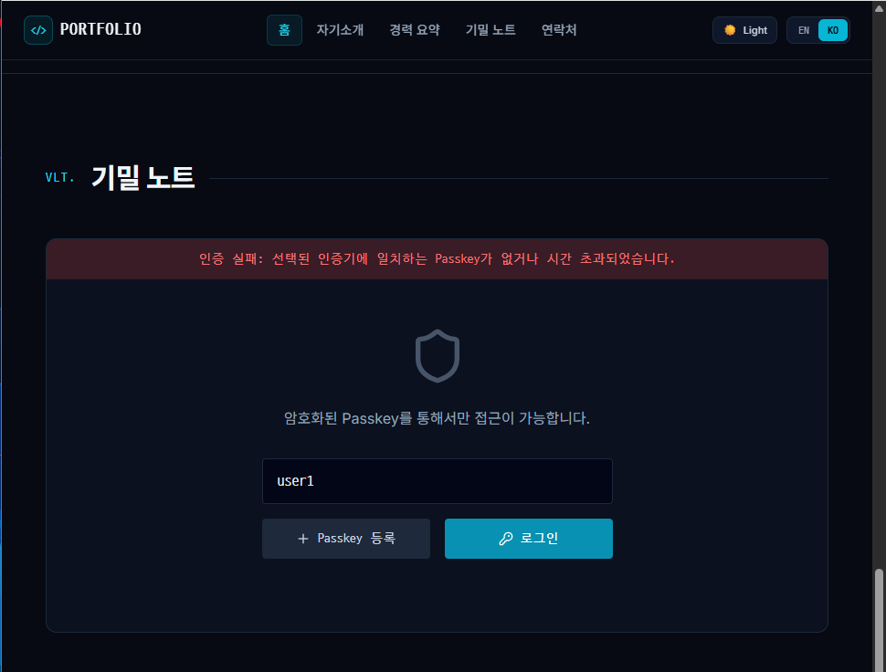

---

### 💳 Card 5: 계정 간 데이터 격리 및 BOLA/IDOR 방어 (Cross-Account Isolation & BOLA Defense)
* **목표**: A 사용자와 B 사용자의 기밀 데이터가 분리되며, 파라미터 조작을 통한 타 계정 탈취가 원천 차단됨을 증명.

#### 검증 사진 5-1: user2 세션에서 user1 데이터 탈취 시도 차단 (`HTTP 403`)
* **설명**: `user2`로 로그인된 상태에서 F12 콘솔로 `fetch('/api/vault/data?username=user1')` 호출 시 서버가 `403 Forbidden` 및 `Cross-account access denied (BOLA/IDOR protection enforced)` 에러를 반환하며 차단하는 화면.

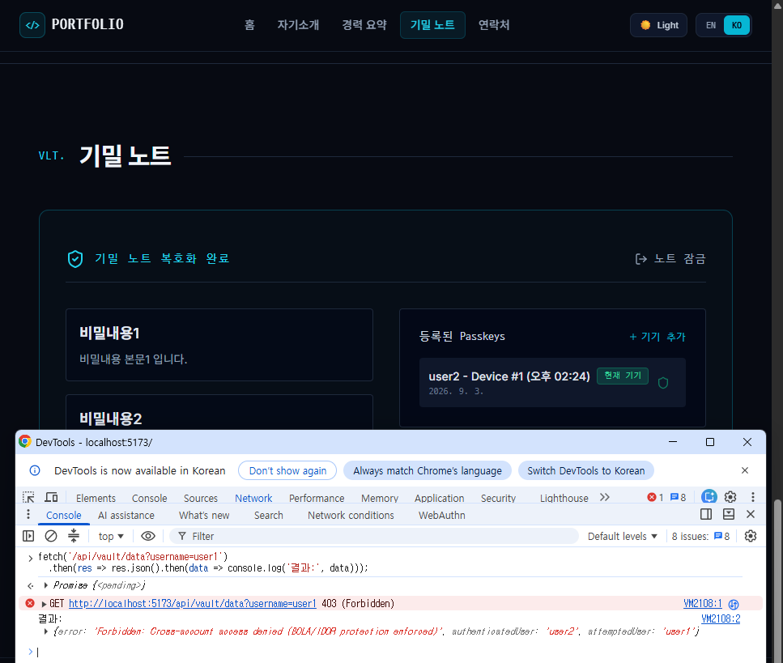

#### 검증 사진 5-2: user1 세션에서 user2 데이터 탈취 시도 차단 (`HTTP 403`)
* **설명**: 반대로 `user1`으로 로그인된 상태에서 `fetch('/api/vault/data?username=user2')` 호출 시에도 동일하게 `403 Forbidden`으로 상호 완벽 차단되는 화면.

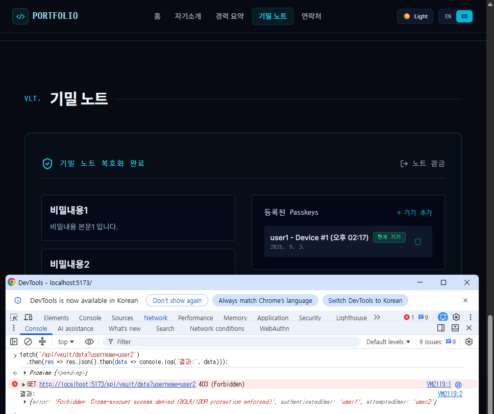

#### 검증 사진 5-3: 서버 터미널 실시간 BOLA/IDOR 침해 경고 로그
* **설명**: 백엔드 터미널에 `[Security Alert: BOLA/IDOR Prevented] Authenticated user 'user2' attempted unauthorized access to 'user1' resources!` 및 상호 차단 감사 로그가 기록된 화면.

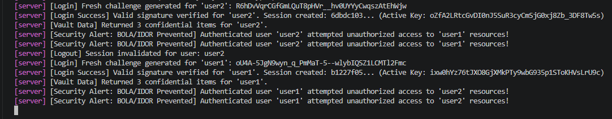

---

## Part E: HTTP 요청/응답 페이로드 명세서 (Audit Payload Specification)

```http
### 1. 패스키 등록 챌린지 요청 (Client -> Server)
POST /api/auth/register/generate-options HTTP/1.1
Host: localhost:5173
Content-Type: application/json

{
  "username": "user1"
}

### 2. 패스키 등록 서명 검증 및 공개키 저장 (Client -> Server)
POST /api/auth/register/verify HTTP/1.1
Host: localhost:5173
Content-Type: application/json

{
  "username": "user1",
  "name": "user1 - Device #1",
  "response": {
    "id": "Rv3eN4epbzOPJ2lzuqO8NoYbLanyEv3Z38joaHpYezU",
    "rawId": "Rv3eN4epbzOPJ2lzuqO8NoYbLanyEv3Z38joaHpYezU",
    "response": {
      "clientDataJSON": "eyJ0eXBlIjoid2ViYXV0aG4uY3JlYXRlIiwiY2hhbGxlbmdlIjoi...",
      "attestationObject": "o2NmbXRoZmlkby11MmZnYXR0U3RtdKJjc2lnWEcw..."
    },
    "type": "public-key"
  }
}

### 3. 기밀 데이터 안전 조회 (BOLA/IDOR 방어 검증)
GET /api/vault/data HTTP/1.1
Host: localhost:5173
Cookie: sessionId=4f8b2c8a-11e2-419b-a01c-6d2c49c0e5a1

HTTP/1.1 200 OK
Content-Type: application/json

{
  "items": [
    { "id": 1, "title": "비밀내용1", "content": "비밀내용 본문1 입니다." },
    { "id": 2, "title": "비밀내용2", "content": "비밀내용 본문2 입니다." },
    { "id": 3, "title": "비밀내용3", "content": "비밀내용 본문3 입니다." }
  ]
}
```
